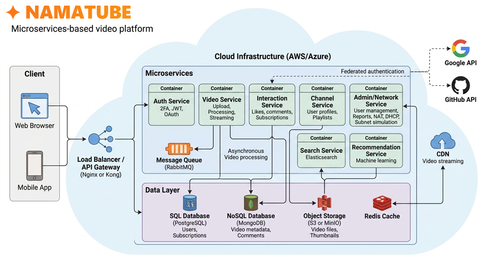
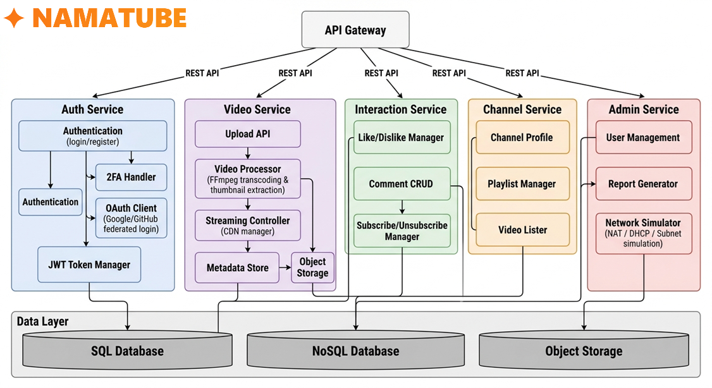
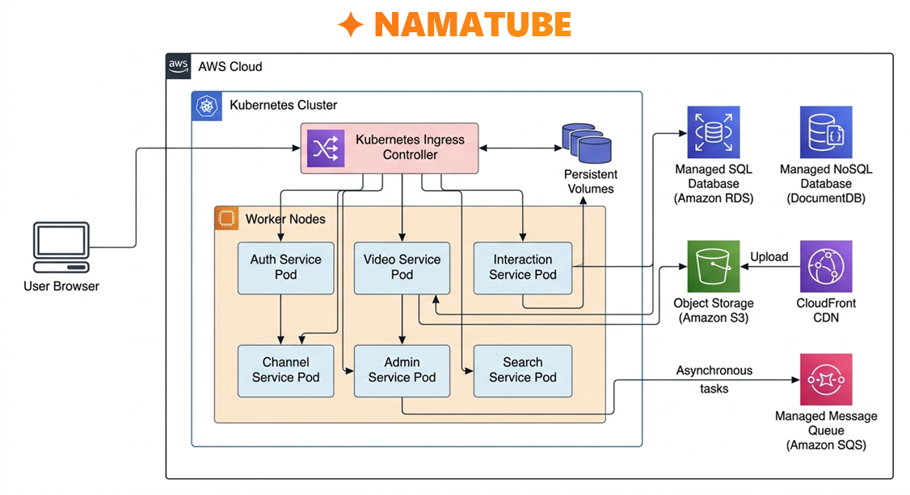
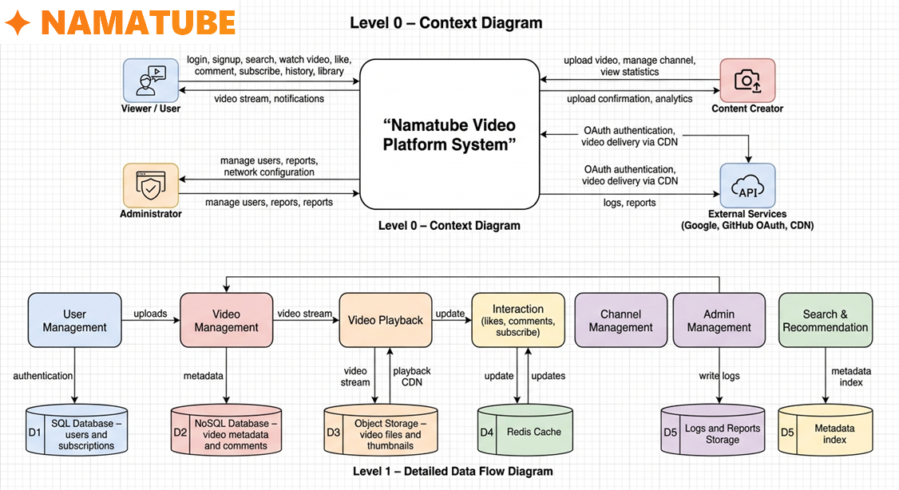

# 🎥 Namatube

<div align="center">



**A modern, scalable video sharing platform built with microservices architecture**

[](LICENSE)
[](docker-compose.yml)
[](NamaFront/)
[](NamaBackend/)

</div>

## 📋 Table of Contents

- [Overview](#overview)
- [Architecture](#architecture)
- [Features](#features)
- [Tech Stack](#tech-stack)
- [Getting Started](#getting-started)
- [Project Structure](#project-structure)
- [API Documentation](#api-documentation)
- [Development](#development)
- [License](#license)
- [Contact](#contact)

## 🎯 Overview

Namatube is a comprehensive video sharing platform designed with modern microservices architecture. It provides a YouTube-like experience with features including video upload, streaming, user interactions, recommendations, and channel management.

The platform is built to support high concurrent loads (1000+ users), maintain 99.9% uptime, and deliver adaptive video streaming through CDN integration.

## 🏗️ Architecture

Namatube follows a **microservices architecture** with complete separation of concerns:

### System Components



**Core Microservices:**
- **Auth Service**: JWT authentication, OAuth (Google/GitHub), 2FA
- **Video Service**: Upload, transcoding (FFmpeg), streaming management
- **Interaction Service**: Likes, comments, subscriptions
- **Channel Service**: Channel profiles, playlists, video listings
- **Admin Service**: User management, reporting, network simulation
- **Search Service**: Elasticsearch-powered full-text search
- **Recommendation Service**: Personalized video recommendations

**Infrastructure:**
- **API Gateway**: Nginx/Kong for routing and rate limiting
- **Message Queue**: RabbitMQ for asynchronous video processing
- **Databases**: 
  - PostgreSQL (relational data)
  - MongoDB (metadata/comments)
  - Redis (caching)
  - MinIO/S3 (object storage for media)

### Deployment Architecture



### Data Flow



## ✨ Features

### User Features
- 🔐 User registration and authentication (Email, OAuth)
- 📹 Video upload with automatic transcoding to multiple resolutions
- 🎬 Adaptive bitrate streaming
- 👍 Like/Dislike videos and comments
- 💬 Comment system with threaded replies
- 🔔 Subscription and notification system
- 🔍 Full-text search with advanced filtering
- 📊 Personalized recommendations
- 📱 Responsive UI (mobile and desktop)
- 🌍 Multilingual support (including Persian/RTL)

### Content Creator Features
- 📺 Channel management
- 📋 Playlist creation and management
- 🔒 Video privacy settings (Public/Unlisted/Private)
- 📈 Video analytics and metrics

### Admin Features
- 👥 User management and moderation
- 🚫 Content moderation and violation reporting
- 📊 System monitoring and health checks
- 🌐 Network simulation tools

## 🛠️ Tech Stack

### Frontend (NamaFront)
- **Framework**: React
- **State Management**: TBD
- **HTTP Client**: Axios
- **UI Components**: TBD

### Backend (NamaBackend)
- **Framework**: Django + Django REST Framework
- **Authentication**: JWT, OAuth2
- **Video Processing**: FFmpeg
- **Task Queue**: Celery + RabbitMQ

### Infrastructure
- **Containerization**: Docker + Docker Compose
- **Orchestration**: Kubernetes (production)
- **Databases**: PostgreSQL, MongoDB, Redis
- **Object Storage**: MinIO (local), S3 (production)
- **CDN**: CloudFront / Custom CDN
- **API Gateway**: Nginx / Kong
- **Monitoring**: CloudWatch, Structured JSON logging

## 🚀 Getting Started

### Prerequisites

- Docker (>= 20.10)
- Docker Compose (>= 2.0)
- Git

### Quick Start

1. **Clone the repository**
```bash
git clone https://github.com/yourusername/Namatube.git
cd Namatube
```

2. **Start the entire stack**
```bash
docker-compose up -d
```

This single command will spin up:
- All microservices (Auth, Video, Interaction, Channel, Admin, Search, Recommendation)
- PostgreSQL database
- MongoDB
- Redis cache
- RabbitMQ message queue
- MinIO object storage
- API Gateway
- Frontend application

3. **Access the application**
- Frontend: http://localhost:3000
- API Gateway: http://localhost:8000
- MinIO Console: http://localhost:9001

### Environment Configuration

Copy the example environment file and configure:
```bash
cp .env.example .env
```

Edit `.env` with your configuration (database credentials, API keys, etc.)

## 📁 Project Structure

```
Namatube/
├── NamaFront/              # React frontend application
├── NamaBackend/            # Django microservices
│   ├── auth_service/
│   ├── video_service/
│   ├── interaction_service/
│   ├── channel_service/
│   ├── admin_service/
│   ├── search_service/
│   └── recommendation_service/
├── docs/                   # Documentation
│   ├── figures/            # Architecture diagrams
│   ├── Functional.md       # Functional requirements
│   ├── Non-Functional.md   # Non-functional requirements
│   └── System-Architecture-Document.md
├── .specify/               # Project governance
│   └── memory/
│       └── constitution.md # Project constitution
├── API.md                  # API contract documentation
├── STRUCTURE.md            # Project structure guide
├── AGENTS.md               # AI agent guidelines
├── docker-compose.yml      # Local development orchestration
└── README.md               # This file
```

## 📚 API Documentation

All API endpoints are documented in [API.md](API.md). The API follows RESTful principles with:
- JWT-based authentication
- Standardized JSON responses
- Comprehensive error handling
- Rate limiting (1000 req/hour authenticated, 100 req/hour public)

Key endpoint groups:
- `/api/v1/auth/*` - Authentication
- `/api/v1/videos/*` - Video management
- `/api/v1/channels/*` - Channel operations
- `/api/v1/search` - Search functionality
- `/api/v1/recommendations` - Personalized recommendations

## 💻 Development

### Running Tests

```bash
# Frontend tests
cd NamaFront && npm test

# Backend tests
cd NamaBackend && python manage.py test
```

### CI/CD

All branches are automatically tested via GitHub Actions:
- Linting
- Unit tests
- Integration tests
- Build verification

Pull requests must pass all checks before merging.

### Code Standards

- Follow the project [Constitution](.specify/memory/constitution.md)
- Read [AGENTS.md](AGENTS.md) for implementation guidelines
- API changes must update [API.md](API.md) first
- All features require test coverage

### Documentation

- [System Architecture](docs/System-Architecture-Document.md)
- [Functional Requirements](docs/Functional.md)
- [Non-Functional Requirements](docs/Non-Functional.md)
- [Project Structure](STRUCTURE.md)

## 📄 License

This project is licensed under a Custom License - see the [LICENSE](LICENSE) file for details.

**Summary:**
- ✅ Free for personal, educational, and non-commercial use
- ✅ Attribution required (Mohammad Amin Haji Alirezaei)
- ❌ Commercial use requires explicit permission

For commercial licensing inquiries, contact: m.a.hajialirezaei05@gmail.com

## 👤 Contact

**Mohammad Amin Haji Alirezaei**

- Email: m.a.hajialirezaei05@gmail.com
- Project Link: [https://github.com/mahajialirezaei/Namatube](https://github.com/mahajialirezaei/Namatube)

## 🙏 Acknowledgments

- Inspired by modern video sharing platforms
- Built as part of System Analysis and Design coursework
- Special thanks to contributors and the open-source community

---

<div align="center">

**Made with ❤️ by Mohammad Amin Haji Alirezaei**

</div>
